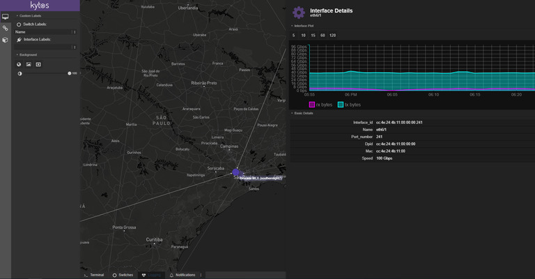
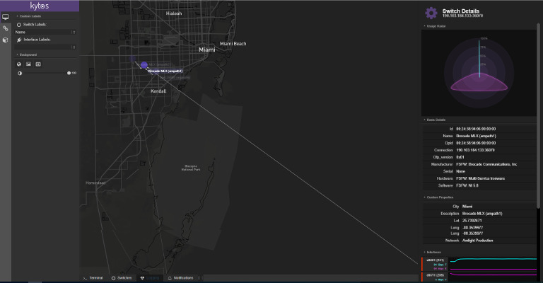
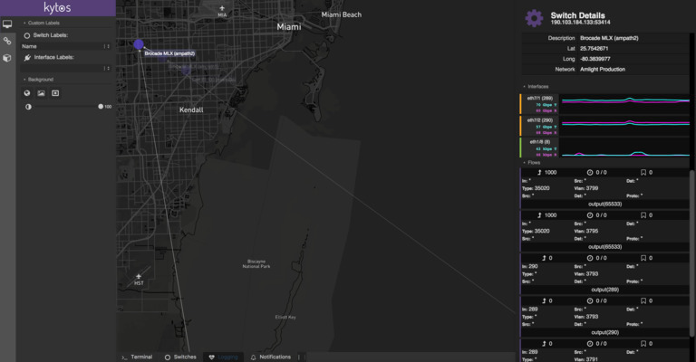

*************
Web Interface
*************

Kytos installs automatically a web-based interface for administration. When
it is running, the Web UI runs in your localhost and can be accessed via
browser, in http://localhost:8181. Have fun (:

   Traffic Switch Panel.

   Info Switch Panel.

   Graph Switch Panel.

