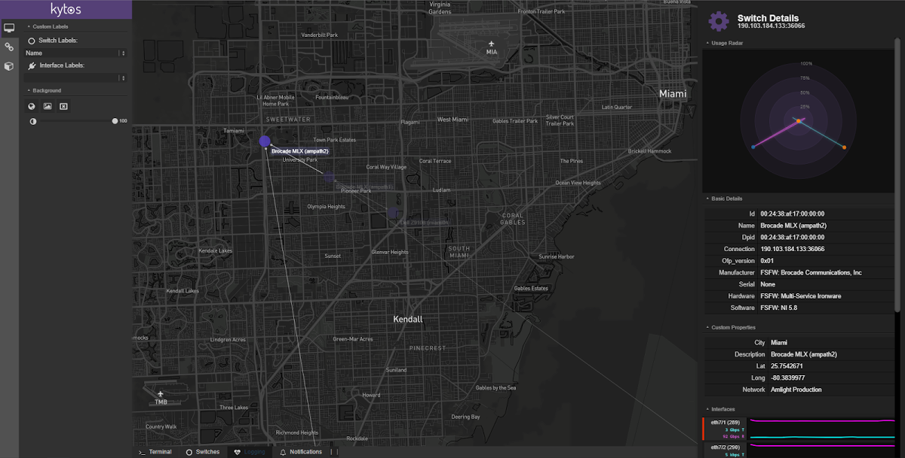
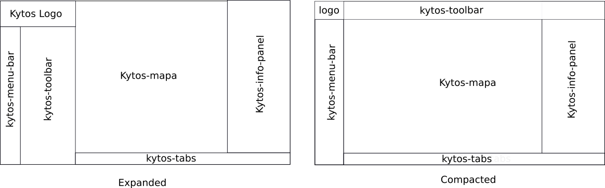

*************
Web Interface
*************

kytos has a friendly and flexible interface.  We tried to make the UI in such a
way that it could be coupled new components in an easy and intuitive way.
The developer of an NApp (`Dev Guide
<https://docs.kytos.io/kytos/developer/>`_) no longer needs to change the
Kytos core source code to add its components in the interface.

This document shows how you, the developer of an NApp, can build your graphical
screens using the Kytos platform.

   Kytos Graphical User Interface

Understanding Kytos UI Sections
*******************************

Our interface is constantly changing, we are always evolving, even more at this
early stage of the project. But we believe that we reach a layout that we are
comfortable to evolve from it.

The following images you can see the Kytos UI sections.

As you can see, our Kytos Toolbar can be expanded or compressed (at top of
screen).

Menu Bar
========
UI component: `k-menu-bar`

The bar menu is a small vertical band that sits on the left side of the screen
under the logo. This menu consists of buttons that trigger the respective
toolbars, or trigger other actions.

The amount of buttons (items) that will appear here will depend on how many
NApps you have enabled in Kytos. As a NApp developer, you can register a new
entry here, creating a file and defining a new toolbar under the
`ui/k-toolbar/` folder. We will describe this better, latter.

Toolbar
=======
UI component: `k-toolbar`

The `k-toolbar` component contains the current activated `k-menu-bar` item.
This is the content of the toolbar component defined by the NApps.

This toolbar is usually used for **input** controls. For example, if your
application needs some input from the user, we strongly recommend inserting
these inputs into a toolbar.

This toolbar can exist in two versions: compressed and expanded. When expanded
it appears on the side of `k-menu-bar`, and when compressed it appears at the
top of the screen.

.. note::

    Of course, there are some components that are not good to display in
    compressed form. For instance: it is a big challenge to display a
    `k-property-panel` inside a compressed toolbar. For this reason only
    components with compacted versions will be displayed in the `k-toolbar`
    using the compact form.

    If a component is too big to be compacted it will not be displayed on
    `k-toolbar` compacted version. 

Map/Topology
============
UI component: `k-map`

The `k-map` component is responsible for display a map and render the network
topology will all hosts and connected switches.

For now, you, the developer of NAPP, do not have to worry about this section.
In the future we pretend to make some actions available so you can manipulate
the topology and the map.

Info Panel
==========
UI component: `k-info-panel`

The `k-info-panel` component is responsible for show generic information. So
for example, if you want to display the result of something, or some
information, use the info panel.

Tabs
====
UI component: `k-tabs`

The `k-tabs` components is responsible to have a terminal, show switch
informations, logs of kytos instance and kytos ui alerts.

For now, you, the developer of NAPP, do not have to worry about this section.
In the future we pretend to make some actions available so you can manipulate
the topology and the map.

Actions Menu
============
UI component: `menu-actions`

If you try to press `ctrl + space` a list of actions will appear at the center
of Kytos UI. This is another way to trigger actions that you think that is not
suitable for the toolbar, for instance.

