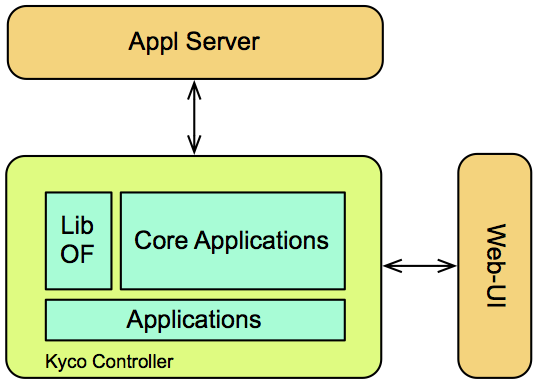

Architechture overview
----------------------

Kyco is a modular SDN controller, which means that it has several parts that,
working together, will compose the Kyco controller. Kyco controller itself is
composed by three parts: OpenFlow Library, Core Applications and Applications.

The OpenFlow library is the implementation of the OpenFlow protocol in Python.
This library is used to unpack and parse incoming OpenFlow messages and create
and pack outgoing OpenFlow messages. The core applications are those that are
needed to the controller operations. A core application is the topology
discovery, which aims to build and display the topology of the network
(switches, hosts and the connections between them). Several core applications
were developed, such as L2 learning switch and so on. Kyco's developer team is
constantly developing new core application to improve Kyco's features.

The applications stack are general applications, created by Kyco’s users.
These applications can be installed, loaded and unloaded on the fly by the
user. Also, these applications make use of the OpenFlow library and information
provided by the core application.

All applications developed by users can be uploaded to the Application Server,
which is a public repository. Once the application is uploaded to this
repository, any user can install, load and run the application. These
applications are called Network Application (or Napp) and the repository is
called the Napp Server.

Finally, a web interface is being developed to manage the controller. This web
interface aims to be intuitive and very easy to use. In Figure 1 is shown how
Kyco's module are connected with each other. 

    Kyco's Architecture.
