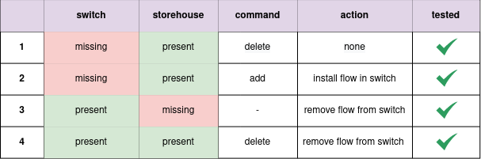
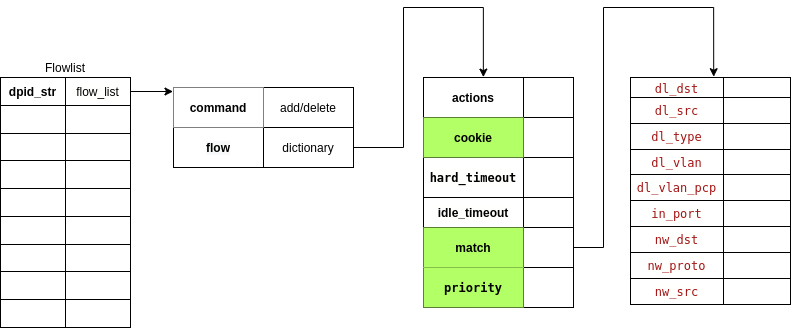

**************************
Consistency Documentation
**************************

The Kytos Project has a consistency module under development that secures the
consistency of the flows installed in the switches. All flows installed by
`kytos/flow_manager` NApp are stored in `kytos/storehouse`. The flows stored
in Storehouse are defined as the true source.  The consistency routine can work
in two different ways, the first one makes a consistency check every X
seconds, and the second one performs the consistency check every time the event 
`kytos/of_core.flow_stats.received` is received. If the `Flows` in 
`kytos/storehouse` are inconsistent with the flows in the switches (a 
divergence was found), a warning message is generated on Kytos console and
an attempt to solve it is made.

The general idea behind this module is to check that all stored flows in the
switches are consistent with the data stored in the controller. If a flow
installed on a switch is not stored in the controller, it means that it
was not installed by the controller and needs to be removed – it is an `alien`
flow. Moreover, if a stored flow in the controller is not installed on the switch,
it means that some error occurred and these `flows` need to be reinstalled
by the controller.

Inconsistency Cases
===================

The consistency module can currently detect and resolve four types of
inconsistencies.

Configuration
=============

The consistency module has been implemented in `kytos/flow_manager` NApp.
Therefore, the consistency configuration is available in the ``settings.py``
file in the `flow_manager` NApp.

The consistency can be deactivated setting the ``CONSISTENCY_INTERVAL``
field to a value less than 0 (e.g. -1). Besides that, the consistency can be 
activated to execute every time the event  `kytos/of_core.flow_stats.received`
is listened setting the ``CONSISTENCY_INTERVAL`` field to value 0. If you want 
to execute consistency check every X seconds, the ``CONSISTENCY_INTERVAL`` 
field should be set to X value, (e.g. 60).

Data Structure
==============

The data stored in the `kytos/storehouse` follows the format defined below:

