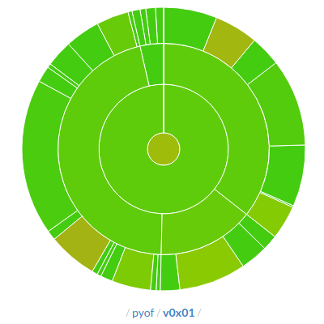
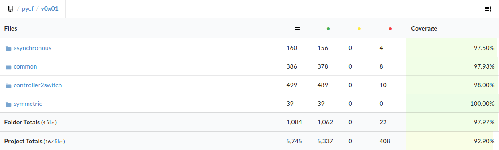
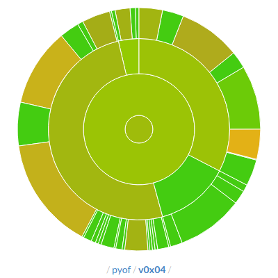
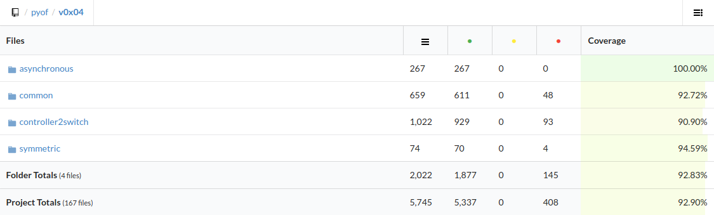

***************
Python OpenFlow
***************

Basic lib organization
======================

Repository file tree
--------------------

::

  - docs/
  - pyof/
    - foundation/
    - v0x01/
    - v0x04/
  - raw/
  - tests/

Description
-----------

Each openflow version is a subpackage inside the ``pyof`` package. It contains
the version classes for messages and structures, which are organized according
to the categories defined in the spec, like 'common', 'asynchronous', etc.
Structures that are used by more than one category are usually placed in the
'common' category.

docs/
    Sphinx documentation.

pyof/
    Main python-openflow module.

pyof/foundation/
    Subpackage containing classes used/needed to implement a new pyof message
    or structure, like ``foundation.base.GenericStruct`` and many basic types
    like the null terminated string ``foundation.basic_types.Char``.

pyof/v0x01/
    Subpackage containing OpenFlow version 1.0 (0x01) classes for messages,
    structs and enumerations.

pyof/v0x04/
    Subpackage containing OpenFlow version 1.3 (0x04) classes for messages,
    structs and enumerations.

raw/
    Raw OpenFlow message dumps to be used by the test suite.

tests/
    Package with python-openflow test suite.

How to use it
=============

importing
---------
To use the python-openflow module you need to import its classes directly
from its submodule.

To create a v0x04 Hello message for example, you need to import its class
from the ``pyof.v0x04.symmetric.hello`` submodule using the statement:

.. code:: python

  >>> from pyof.v0x01.symmetric.hello import Hello
  >>> hello_message = Hello()

Pyof objects
------------
pyof objects are instances of GenericStruct or GenericType or other classes
derived from these.
They provide the methods ``pack`` ``unpack`` and ``get_size``.

Initialization
--------------
``GenericType`` derivatives accept as argument an initial value.
``GenericStruct`` derivatives usually accept as argument initial values
for its class attributes.

Packing
-------
To pack a pyof object, simply call its ``pack()`` method, which returns a
``bytes`` object of the binary representation.

Unpacking
---------
To unpack a buffer as pyof object, simply initialize a new object and
call its ``unpack()`` method, passing the buffer as the argument. The
buffer will be unpacked in place setting the attributes of the object
instance used to make the call.
Exceptions to this case are ``GenericMessage``s derivatives, whose
``unpack()`` method receives as argument a buffer containing only the
message body.

New definitions
===============
``python-openflow`` provides some base classes and basic type classes meant to
be used in a new message/struct class definition.

Difference between "structs" and "messages"
-------------------------------------------
Messages are GenericStruct derivatives who carry a header attribute containing
an OpenFlow header struct.

Unlike ``GenericStruct`` s their unpack method accepts a buffer argument with
its binary body (without the associated header).

How to code a new struct/message
--------------------------------
To implement a new struct, you need to:
- define a new class which derives from ``GenericStruct``;
- define class attributes in following the order in which they must be packed
(with optional initial values) whose type are pyof objects themselves.

Struct example (``myexamplestruct.py``):

.. code:: python

    >>> from pyof.foundation.base import GenericStruct
    >>> from pyof.foundation.basic_types import UBInt8, UBInt16

    >>> class MyNewStruct(GenericStruct):
            my_first_attribute = UBInt8(255)
            my_second_attribute = UBInt16(0)
            my_third_attribute = UBInt8(255)

            def __init__(self, my_third_attribute=None):
                super().__init__()
            	self.my_third_attribute = my_third_attribute

which can be used like this:

.. code:: python

    >>> my_struct = MyNewStruct()
    >>> my_struct.my_second_attribute = 2
    >>> p = my_struct.pack()
    >>> print(p)
    b'\xff\x00\x02\xff'

    >>> my_struct_2 = MyNewStruct()
    >>> my_struct_2.unpack(p)
    >>> my_struct_2.my_second_attribute
    UBInt16(2)

Message example:

.. code:: python

    >>> from pyof.foundation.base import GenericMessage
    >>> from pyof.foundation.basic_types import UBInt8, UBInt16
    >>> from pyof.v0x04.common.header import Header
    >>> from myexamplestruct import MyNewStruct

    >>> class MyNewMessage(GenericMessage):
            header = Header(message_type=255)
            my_struct_field = MyNewStruct()

which can be used like this:

.. code:: python

    >>> message = MyNewMessage()
    >>> message.header.xid = 65280
    >>> message.my_struct_field = my_struct_2
    >>> message.pack()
    b'\x04\xff\x00\x0c\x00\x00\xff\x00\xff\x00\x00\xff'

How to start a new "pyof version"
---------------------------------

- Create a new package under ``pyof`` named after the version you are
  interested in implementing, like ``v0xff`` for example.
- Create new subpackages for your message categories.
- Implement your new message as described before.

Your file tree should look like this::

  - pyof/
    + foundation/
    - v0xff/
      __init__.py
      - my_message_category/
        __init__.py
        mynewmessage.py

Python-OpenFlow API
===================

Python-OpenFlow is a library used to create NApps to work with the
OpenFlow protocol. The documentation of the library is located at
`python-openflow api <https://docs.kytos.io/python-openflow/pyof>`__.

Coverage
========

Code coverage is a metric that can help you understand how much of your source
is tested. It's a very useful metric that can help you assess the quality of
your test suite.

In the following sections you will see the chart and table for OpenFlow 1.0 and
1.3 versions, if you would like to see the coverage of each file, 
`click here <https://codecov.io/gh/gleybersonandrade/python-openflow>`__.

.. image:: https://codecov.io/gh/gleybersonandrade/python-openflow/branch/master/graph/badge.svg
  :target: https://codecov.io/gh/gleybersonandrade/python-openflow

Python OpenFlow 1.0
-------------------

Python OpenFlow 1.3
-------------------

