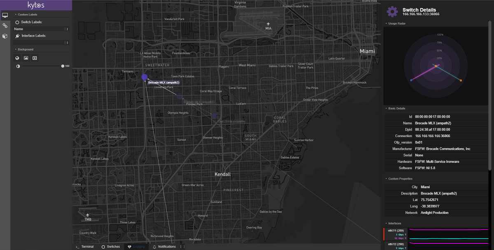
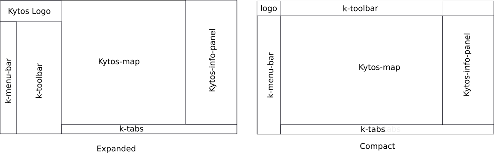

*************
Web Interface
*************

kytos has a friendly and flexible interface.  We tried to make the UI in such a
way that it could be coupled new components in an easy and intuitive way.
The developer of an NApp (`Dev Guide
<https://docs.kytos.io/kytos/developer/>`_) no longer needs to change the
Kytos core source code to add its components in the interface.

This document shows how you, the developer of an NApp, can build your graphical
screens using the Kytos platform.

   Kytos Graphical User Interface

Understanding Kytos UI Sections
*******************************

Our interface is constantly changing, we are always evolving, even more at this
early stage of the project. But we believe that we reach a layout that we are
comfortable to evolve from it.

The following images you can see the Kytos UI sections.

As you can see, our Kytos Toolbar can be expanded or compressed (at top of
screen).

Menu Bar
========
UI component: `k-menu-bar`

The bar menu is a small vertical band that sits on the left side of the screen
under the logo. This menu consists of buttons that trigger the respective
toolbars, or trigger other actions.

The amount of buttons (items) that will appear here will depend on how many
NApps you have enabled in Kytos. As a NApp developer, you can register a new
entry here, creating a file and defining a new toolbar under the
`ui/k-toolbar/` folder. We will describe this better, latter.

Toolbar
=======
UI component: `k-toolbar`

The `k-toolbar` component contains the current activated `k-menu-bar` item.
This is the content of the toolbar component defined by the NApps.

This toolbar is usually used for **input** controls. For example, if your
application needs some input from the user, we strongly recommend inserting
these inputs into a toolbar.

This toolbar can exist in two versions: compressed and expanded. When expanded
it appears on the side of `k-menu-bar`, and when compressed it appears at the
top of the screen.

.. note::

    Of course, there are some components that are not good to display in
    compressed form. For instance: it is a big challenge to display a
    `k-property-panel` inside a compressed toolbar. For this reason only
    components with compacted versions will be displayed in the `k-toolbar`
    using the compact form.

    If a component is too big to be compacted it will not be displayed on
    `k-toolbar` compacted version. 

Map/Topology
============
UI component: `k-map`

The `k-map` component is responsible for display a map and render the network
topology will all hosts and connected switches.

For now, you, the developer of NAPP, do not have to worry about this section.
In the future we pretend to make some actions available so you can manipulate
the topology and the map.

Info Panel
==========
UI component: `k-info-panel`

The `k-info-panel` component is responsible for show generic information. So
for example, if you want to display the result of something, or some
information, use the info panel.

Tabs
====
UI component: `k-tabs`

The `k-tabs` components is responsible to have a terminal, show switch
informations, logs of kytos instance and kytos ui alerts.

For now, you, the developer of NAPP, do not have to worry about this section.
In the future we pretend to make some actions available so you can manipulate
the topology and the map.

Actions Menu
============
UI component: `menu-actions`

If you try to press `ctrl + space` a list of actions will appear at the center
of Kytos UI. This is another way to trigger actions that you think that is not
suitable for the toolbar, for instance.

Check all UI components in `Kytos UI components section <../kytos_ui_components>`_

Creating a NApp with UI
***********************

Most of the times, it is necessary for a NApp to interact with the user, for
through a graphical interface (not just REST APIs).

We have developed `vue-js` based components (`Vuejs <https://vuejs.org>`_), so
that you, developer, worry as little as possible about interface. Do not worry,
you don't have to understand how `vue-js` works.

In theory, during the construction of your NApp UI you can write any HTML code
that Kytos will render. However, we strongly recommend that you use the
components we have developed. The so-called ``k-*`` components.

NApp Structure with a UI
========================

After create a new NApp (see this `NApp tutorial
<https://tutorials.kytos.io/napps/create_your_napp/>`_) the structure below
will be created.

.. code-block:: sh

  <username>
  ├── __init__.py
  └── <napp_name>/
      ├── __init__.py
      ├── kytos.json
      ├── main.py
      ├── README.rst
      ├── settings.py
      └── ui/
          ├── k-action-menu/
          ├── k-info-panel/
          ├── k-toolbar/
          └── README.rst

To add a new components into the kytos UI you must create a new file following
the pattern ``ui/<section>/<file_name>.kytos``, where **<section>** should be
the section name where the new component will be fixed and the **<file_name>**
should be the component name. You are free to choose any file name here.

Sections
========

* ``k-action-menu``: Add actions and their shortcuts in `k-action-menu`;

* ``k-info-panel``: Show generic information in `k-info-panel`;

* ``k-toolbar``: Create the NApp UI.

Whether you have created a new NApp component into the sections
``k-action-menu``, ``k-toolbar`` and ``k-info-panel`` the NApp structure should
have the following structure.

.. code-block:: sh

  <username>/
  ├── __init__.py
  └── <napp_name>/
      ├── __init__.py
      ├── kytos.json
      ├── main.py
      ├── README.rst
      ├── settings.py
      └── ui/
          ├── k-action-menu/
          │   └── main.kytos
          ├── k-info-panel/
          │   └── main.kytos
          ├── k-toolbar/
          │   └── main.kytos
          └── README.rst

When the administrator enables your NApp, Kytos will automatically scan the
``ui/*`` structure to properly export to GUI.

.. note::
  Kytos will parse the files structure and try to find your NApp components,
  so you need to create a folder only for the specific UI sections that are
  going to be used. So k-action-menu, k-info-panel and k-toolbar are the three
  UI areas available for using, feel free to create as you need it or not.

Component Template
==================

The Kytos component should follow some rules:

#. The component file should have the extension ``.kytos``

#. The component file must have 2 sections:

  #. template: This section must be filled with html contents to display your
       graphical component.This section should have a html syntax and you can
       use the Kytos components.
  #. script (optional): This section has javascript code that implements your
       component behaviour.

Below an example of a Kytos component (`ui/k-toolbar/main.kytos`), that will be
displayed on our UI.

.. code-block:: html

    <template>

      <k-toolbar-item icon="desktop" tooltip="My application">
          <k-accordion>
              <k-accordion-item>
              // todo: create a example with some inputs and buttons
              </k-accordion-item>
          </k-accordion>
      </k-toolbar-item>

    </template>

    

You can use any **font-awesome icon**. Kytos ui interface will read that icon
and create a new button into the **k-menu-bar**.

Toolbar Component Formats
=========================

A Toolbar component has content defined by the NApps in case it needs some
user input and can exist in two format versions: compressed and expanded. You
can learn more about this at the :doc:`./web-ui` page.

New Toolbar Components that can be displayed in compressed and expanded
formats must declare style attributes for both versions in the style tag.
For the contents of the toolbar, Kytos Input Components already handle both
formats. For new Input Components, the developer must declare the styles for
the formats.

For the compressed view the developer must declare the styles in the class
selector called ``compacted``.

Below is an example of usage in the
`Input <https://github.com/kytos/ui/blob/1.3.1/src/components/kytos/inputs/Input.vue#L104>`_ component:

.. code-block:: html

    

First it declare the style for the expanded format in the `.k-input-wrap`
class and then the compressed format in the `.compacted` / `.k-input-wrap`
classes. This example apply for the toolbar component and input components.

If the Toolbar Component is not suitable for display in compressed format, the
developer can hide it completely, parts of its content, or just some Input
components.

A few Kytos Input components cannot be displayed in compressed format, such as
TextArea, Table and PropertyPanel because they have dimensions that cannot fit
in this toolbar format and are hidden by default.

To hide a toolbar component or its content the developer must add the name
``no-compact`` to the class attribute in the template. It will signal the view
that the component will not be displayed in compressed form.

Below is an example of usage the
`Textarea <https://github.com/kytos/ui/blob/1.3.1/src/components/kytos/inputs/Textarea.vue#L2>`_ component:

.. code-block:: html

    <template>
      

        ...
      

    </template>